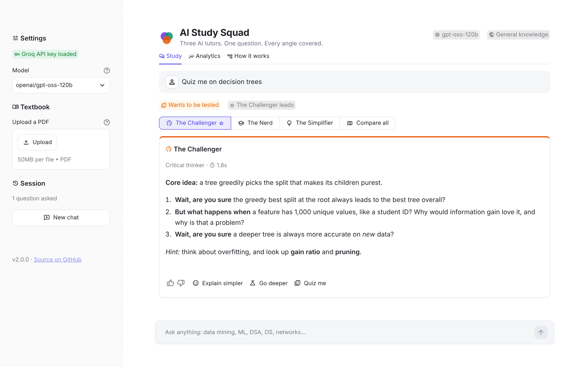
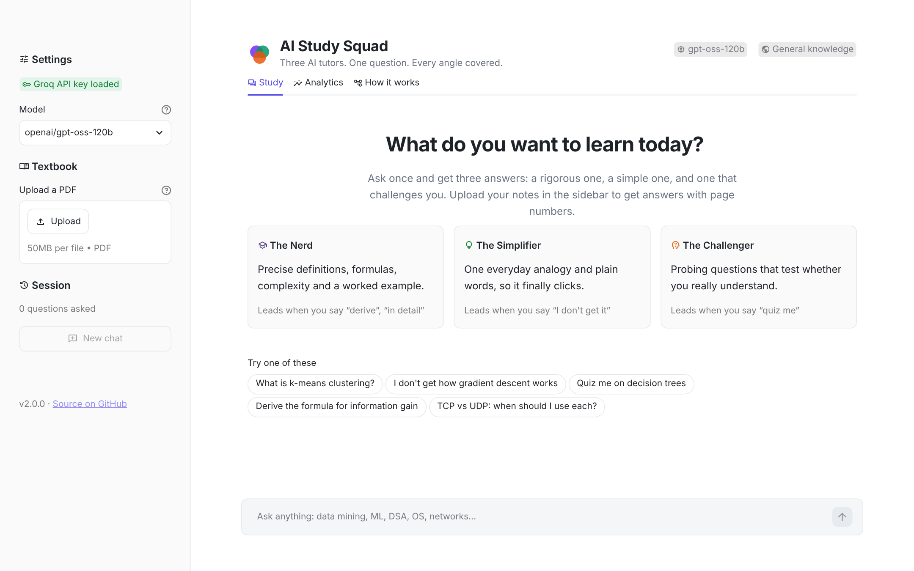
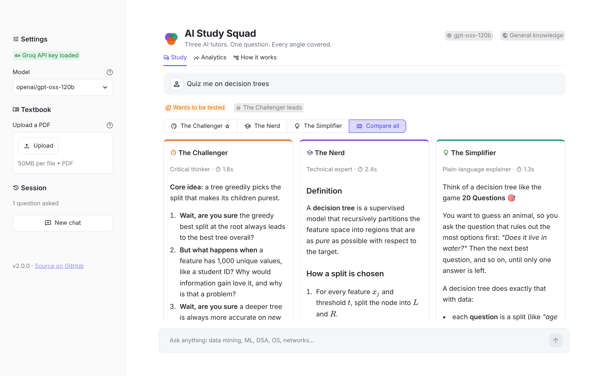
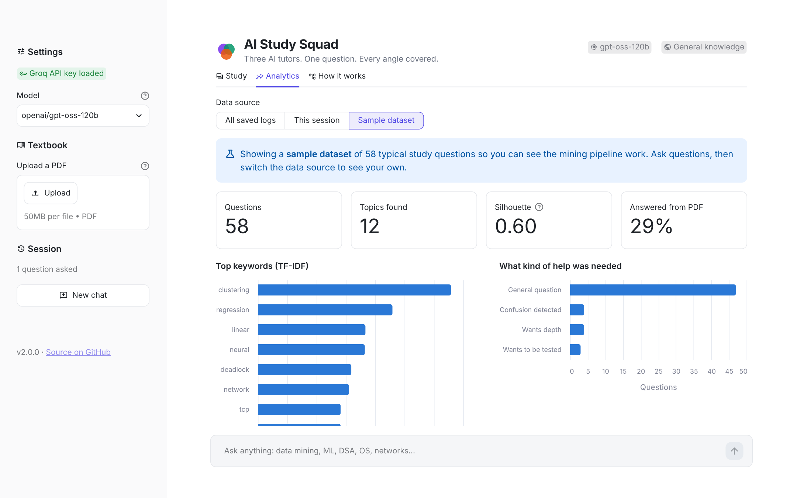
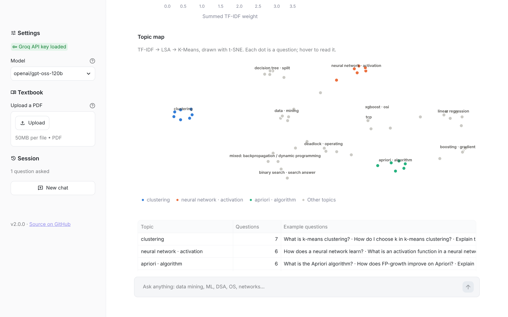
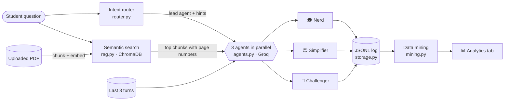

<div align="center">

# 🧠 AI Study Squad

**Three AI tutors answer every question from three angles, grounded in your own textbook, with data-mining analytics on how you study.**

[](https://github.com/katalnishant/ai-study-squad/actions/workflows/ci.yml)
[](#-run-it-locally)
[](https://streamlit.io)
[](LICENSE)

[](https://ai-study-squad-nishant.streamlit.app)

### [▶ Try the live app](https://ai-study-squad-nishant.streamlit.app)



</div>

---

## ✨ What it does

Ask one question and three agents answer **at the same time**, side by side:

| Agent | Style | Best for |
|---|---|---|
| 🎓 **The Nerd** | Definitions, formulas, complexity, a worked example | Exam-ready depth |
| 😊 **The Simplifier** | One everyday analogy, plain words | Getting the intuition fast |
| 🤔 **The Challenger** | Probing questions about edge cases and misconceptions | Testing whether you *really* understand |

On top of that:

- **🧭 Intent routing.** Say *"I don't get it"* and the Simplifier leads (its answer opens first and it is told to start from zero). *"Quiz me"* puts the Challenger in front; *"derive"* or *"time complexity"* puts the Nerd in front.
- **🎯 Focus or compare.** Read the lead answer full-width, switch tutors with one click, or compare all three side by side.
- **⚡ Live progress.** All three tutors run in parallel and each one ticks off as soon as its answer is ready.
- **🔁 One-click follow-ups.** *Explain simpler*, *Go deeper* and *Quiz me* under every answer, each one routed to the right tutor.
- **📚 Textbook memory (RAG).** Upload a PDF and answers are grounded in it **with page citations**. Each PDF is indexed once and cached by its hash.
- **💬 Conversation memory.** Follow-ups like *"how does it work?"* include the last few turns, so the tutors know what "it" is.
- **📊 Learning analytics.** TF-IDF keyword mining, **LSA + K-Means topic clustering** (with *k* picked automatically by silhouette score), a t-SNE topic map, and thumbs up/down ratings showing **which tutor helps most**.

## 📸 Screenshots

| Welcome screen | Compare all three tutors |
|---|---|
|  |  |

| Learning analytics | Topic map |
|---|---|
|  |  |

*Analytics screenshots use the bundled sample dataset (`data/sample_logs.jsonl`).*

## 🏗️ How it works



| Module | Responsibility |
|---|---|
| [`streamlit_app.py`](streamlit_app.py) | UI: welcome screen, focus/compare answer views, live progress, follow-ups, ratings, analytics |
| [`study_squad/agents.py`](study_squad/agents.py) | Agent prompts, message building with history and context, parallel calls, friendly API errors |
| [`study_squad/router.py`](study_squad/router.py) | Rule-based intent detection (confused / challenge / depth) and agent ordering |
| [`study_squad/rag.py`](study_squad/rag.py) | PDF → page-aware overlapping chunks → embeddings → ChromaDB cosine search |
| [`study_squad/storage.py`](study_squad/storage.py) | Append-only JSONL logs; reads older log formats too |
| [`study_squad/mining.py`](study_squad/mining.py) | TF-IDF keywords, LSA + K-Means clustering, t-SNE map, usage and helpfulness statistics |
| [`study_squad/charts.py`](study_squad/charts.py) | Altair charts for the Analytics tab |
| [`study_squad/config.py`](study_squad/config.py) | Settings from `.env` or Streamlit secrets |

## 🔬 Data-mining pipeline and results

1. **Cleaning:** drop empty messages, `exit`, pasted terminal commands; remove English and study-filler stop words (*explain, please, detail, …*).
2. **TF-IDF** on unigrams and bigrams with sub-linear term frequency.
3. **LSA:** Truncated SVD to ≈ √n + 2 dimensions, then L2 normalisation. Short questions give very sparse vectors, and LSA turns them into dense "concept" vectors that cluster far better.
4. **K-Means** for every *k* from 2 to 12; keep the *k* with the highest **silhouette score**.
5. **Labelling:** each topic is named by the top TF-IDF terms shared by at least 30% of its questions.
6. **t-SNE** projects the LSA vectors to 2-D for the topic map.

**Evaluation.** The sample set has 58 questions from 8 known subjects. Hiding the labels and comparing the clusters with the true subjects using the **Adjusted Rand Index** (1.0 = perfect, 0 = random):

| Method | k | ARI |
|---|---:|---:|
| TF-IDF + K-Means (k by silhouette) | 11 | 0.331 |
| TF-IDF + K-Means (k = 8, given the true k) | 8 | 0.236 |
| **TF-IDF + LSA + K-Means (k by silhouette), used in the app** | **12** | **0.582** |
| TF-IDF + LSA + K-Means (k = 8, given the true k) | 8 | 0.433 |

Adding LSA improves agreement with the true subjects by **~76%** (0.33 → 0.58). Reproduce with `python scripts/evaluate_clustering.py`; a unit test keeps ARI ≥ 0.5 so later changes can't silently make it worse.

## 🤖 Which AI model?

The app uses the **[Groq](https://groq.com) API** (fast LLM hosting; not xAI's *Grok*). Groq serves several open-weight models, and you pick one in the sidebar:

| Model ID on Groq | Made by | Notes |
|---|---|---|
| `openai/gpt-oss-120b` | OpenAI (open-weight) | Default, best quality |
| `openai/gpt-oss-20b` | OpenAI (open-weight) | Fastest |
| `qwen/qwen3.8-27b` | Alibaba | Alternative |

The `openai/` prefix only says who trained the model: every request goes to Groq with your Groq key, and nothing is sent to OpenAI. v1 of this project used `llama-3.3-70b-versatile`, which [Groq retired for free accounts on 16 Aug 2026](https://console.groq.com/docs/deprecations), recommending `openai/gpt-oss-120b` as the replacement. To use a different Groq model, set `GROQ_MODEL` in `.env`.

## 🚀 Run it locally

You need **Python 3.11 or 3.12** and a free **Groq API key** from [console.groq.com/keys](https://console.groq.com/keys).

```bash
git clone https://github.com/katalnishant/ai-study-squad.git
cd ai-study-squad

python3 -m venv .venv
source .venv/bin/activate            # Windows: .venv\Scripts\activate
pip install -r requirements.txt

cp .env.example .env                 # then put your key in .env
streamlit run streamlit_app.py
```

The app opens at http://localhost:8501. The first PDF upload downloads the small embedding model (~80 MB) once.

<details>
<summary><b>Configuration options</b></summary>

Set these in `.env` (local) or in Streamlit secrets (cloud):

| Variable | Default | Meaning |
|---|---|---|
| `GROQ_API_KEY` | none | Required. Without it, the sidebar asks for a key. |
| `GROQ_MODEL` | `openai/gpt-oss-120b` | Any Groq chat model; also selectable in the sidebar. |
| `GROQ_REASONING_EFFORT` | `low` | `low` / `medium` / `high` for gpt-oss models. |
| `STUDY_SQUAD_HISTORY_TURNS` | `3` | Past turns sent with each question. |
| `STUDY_SQUAD_PERSIST_LOGS` | `true` | Write questions to `data/study_logs.jsonl`. Set `false` on public deployments. |
| `STUDY_SQUAD_DATA_DIR` | `./data` | Where logs and the vector index live. |

</details>

## ☁️ Deploy on Streamlit Community Cloud (free)

1. Push this repo to GitHub.
2. Go to [share.streamlit.io](https://share.streamlit.io), click **Create app**, choose this repo, branch `main`, main file `streamlit_app.py`.
3. Under **Advanced settings**, pick Python 3.12 and paste the contents of [`.streamlit/secrets.toml.example`](.streamlit/secrets.toml.example) with your real key.
4. Click **Deploy**. The live version of this project runs at **https://ai-study-squad-nishant.streamlit.app**.

`STUDY_SQUAD_PERSIST_LOGS = "false"` keeps visitors' questions private on a public app: analytics then cover each visitor's own session (plus the sample dataset).

## 🧪 Tests

```bash
pip install -r requirements-dev.txt
pytest          # 54 tests, no API key or internet needed
ruff check .    # lint
```

The tests use a fake LLM client and an offline embedding function, and include an end-to-end run of the Streamlit app through `streamlit.testing`. GitHub Actions runs lint and tests on Python 3.11 and 3.12 for every push.

## 📁 Project structure

```
ai-study-squad/
├── streamlit_app.py          # Streamlit UI (entry point)
├── study_squad/              # Application package
│   ├── agents.py  router.py  rag.py
│   ├── storage.py mining.py  charts.py  config.py
├── tests/                    # pytest suite (unit + end-to-end UI)
├── scripts/
│   ├── make_sample_data.py   # builds the labelled sample dataset
│   ├── evaluate_clustering.py# ARI evaluation shown above
│   └── import_legacy_logs.py # converts v1 study_logs.json
├── data/sample_logs.jsonl    # demo data for the Analytics tab
├── assets/                   # README screenshots
├── .github/workflows/ci.yml  # lint + tests on every push
└── .streamlit/               # theme + secrets template
```

## 🗺️ Roadmap

- [ ] Stream answers token by token
- [ ] Dark mode toggle
- [ ] "The Quizzer": multiple-choice quizzes generated from your weakest topics
- [ ] Association-rule mining on topics studied in the same session
- [ ] Voice input
- [ ] Hindi and Punjabi questions via multilingual embeddings

## 👤 Author

**Nishant Katal**: [GitHub @katalnishant](https://github.com/katalnishant)

Started as a Data Mining Lab project (2026) and rebuilt as v2 with tests, CI, RAG citations and a measured clustering pipeline. Licensed under [MIT](LICENSE).
